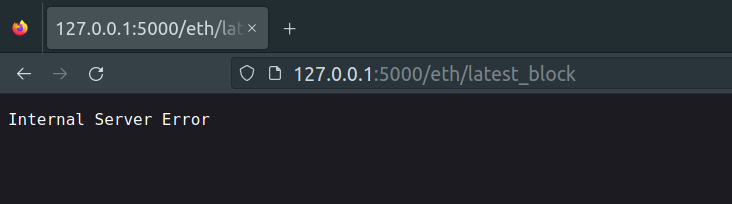

### How I hacked this together:

---
#### What it is:
We're not totally sure yet at this point, but we're
using this as an exercise in building an API in Python
with the FastAPI framework. We're going to pull down some
ethereum blockchain data and see if we can tinker with 
it until we make something at least mildly interesting....but
verry *mild*.

#### Setup:
My first steps in this project was to research how
and where I could get ethereum block chain data. Which leads
us to [Infura](https://infura.io/) and [Web3.py](https://web3py.readthedocs.io/en/v5/index.html).
Web3.py is a library that gives us some handy tools for interacting
with the ethereum blockchain. We *could* set up our own node and
pull down data directly from the blockchain...but that's more than we
bargained for, so we're going to use Infura. They're a remote node provider
that allows us to pull down data through their ethereum nodes. Keeping it
simple here.

Infura has a sweet UI and some helfpul documentation to get us 
started quick. Once we have an account, we click Create New Key
and awaayyyyy we go.
  
<br>

The quick start [guide](https://web3py.readthedocs.io/en/v5/quickstart.html#getting-blockchain-info) from Web3.py is easy to follow and gets
us going with some tools for requesting data, neatO! With IPython and Web3 installed
we can start seeing transactions:

<br>
<br>

Now that we can see data, let's start a python project and start to shape our own project
and make a little pipeline to grab this data and set up our own API with the FastAPI
framework. Below is the skeleton setup of our app. The eth_fastapi module will be our 
api for retrieving and storing down our data, and the web3_api is our module with some
tools for pulling down data using the web3.py library...is this gonna work??? We'll find 
out soon!
  


Then we set up a quick end point to test that our fancy new FastAPI is working:

    

and blamO! we get some dat'r back boii, so freakin sick yoooo:

<br>
<br>
Moving along now we try to pull down some actual data from the blockchain
and push it through our API...but dang, something's not happy:


<br>
I can see the data coming back in my print statement, sow what's going on?...
Well, it looks like pydantic doesn't like the hex values cuz it's trying to 
decode with UTF8....but alas there's actually a toJson() function in the Web3
library (found via this [github issue](https://github.com/ethereum/web3.py/pull/1173)),
so we can do something like the below:

```
def get_latest_block(self):
        latest_block = self.w3.eth.get_block('latest')
        lb_json = Web3.toJSON(latest_block)
        return lb_json 
```
<br>
On to the database. We'll spin up a Postgres db so that we can save this data
and make a pipeline into the db. First we'll test things out with a simple table
to store blocks.